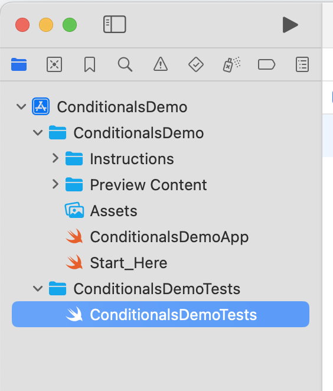
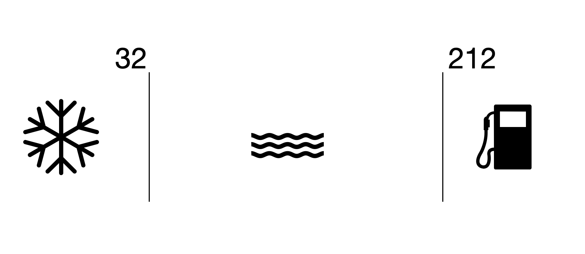

# Conditional Challenges
We have two challenges for you today.  One works with using if then else statements and the other works with switch case statements.  

## Step 1 - Open the Test File 
Open the Conditionals Demo Test in the file explorer. 

## getStateOfH2O
Note that you will be modifying the functions and not the test case area in these unit tests.  There is a comment inside this function showing where you can put your code. The state of H2O can be seen in this diagram below. 

For your function, we will assume that ice includes 32 and everything below while gas includes 212 and everything above. 

Once you have your conditions in, run the test and see if you get a green checkmark. 

## getShapeNameWith
You will be filling this function out with a switch case statement.  You can use the table below to help fill out your switch case.  For the default you will want to return "Let me get back to you on that" 

<table>
  <tr>
    <th> Sides </th>
    <th> Name</th>
  </tr>
  <tr>
    <td> 3 </td>
    <td> triangle</td>
  </tr>
  <tr>
    <td> 4 </td>
    <td> rectangle</td>
  </tr>
  <tr>
    <td> 5 </td>
    <td> pentagon</td>
  </tr>
  <tr>
    <td> 6 </td>
    <td> hexagon</td>
  </tr>
</table>

Run your unit test to check to see how you did.  

